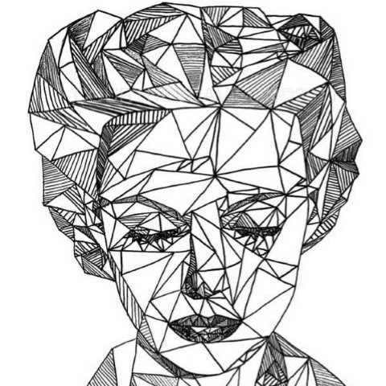
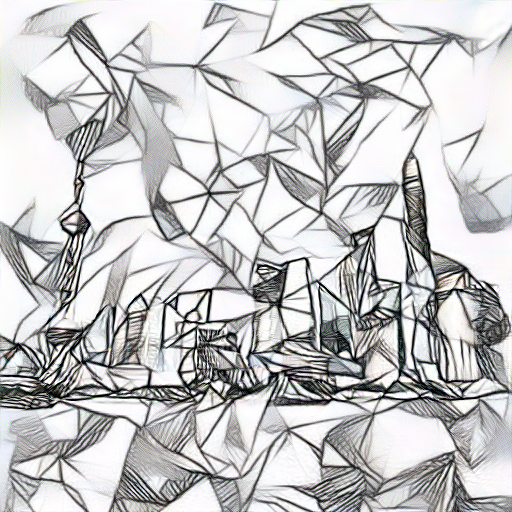

# Pytorch learning with neural style transfer

### Experiment
#### &nbsp; &nbsp; &nbsp; &nbsp; &nbsp; &nbsp; &nbsp; &nbsp; &nbsp; &nbsp; Content Image &nbsp; &nbsp; &nbsp; &nbsp; &nbsp; &nbsp; &nbsp; &nbsp; &nbsp; &nbsp; &nbsp; &nbsp; &nbsp; &nbsp; &nbsp; &nbsp; &nbsp; &nbsp; &nbsp; &nbsp; &nbsp; &nbsp; &nbsp; &nbsp; Style Image
 

### Results
I did some comparison using different layers for content loss, and I like **'conv3_1'** result.

### Some example results
<table>
  <tr>
      <th>Style Image</td>
      <th>Content Image</td>
      <th>Result</td>
   </tr> 
   <tr>
      <td rowspan="4"> </td>
      <td> </td>
      <td> </td>
   </tr> 
   <tr>
      <td> </td>
      <td> </td>
    </tr>
    <tr>
      <td> </td>
      <td> </td>
    </tr>
    <tr>
      <td> </td>
      <td> </td>
    </tr>
    <tr>
      <td rowspan="4"> </td>
      <td> </td>
      <td> </td>
   </tr> 
   <tr>
      <td> </td>
      <td> </td>
    </tr>
    <tr>
      <td> </td>
      <td> </td>
    </tr>
    <tr>
      <td> </td>
      <td> </td>
    </tr>
    <tr>
      <td rowspan="4"> </td>
      <td> </td>
      <td> </td>
   </tr> 
   <tr>
      <td> </td>
      <td> </td>
    </tr>
    <tr>
      <td> </td>
      <td> </td>
    </tr>
    <tr>
      <td> </td>
      <td> </td>
    </tr>
    <tr>
      <td rowspan="4"> </td>
      <td> </td>
      <td> </td>
   </tr> 
   <tr>
      <td> </td>
      <td> </td>
    </tr>
    <tr>
      <td> </td>
      <td> </td>
    </tr>
    <tr>
      <td> </td>
      <td> </td>
    </tr>
    <tr>
      <td rowspan="2"> </td>
      <td> </td>
      <td> </td>
   </tr> 
    <tr>
      <td> </td>
      <td> </td>
    </tr>
</table>

